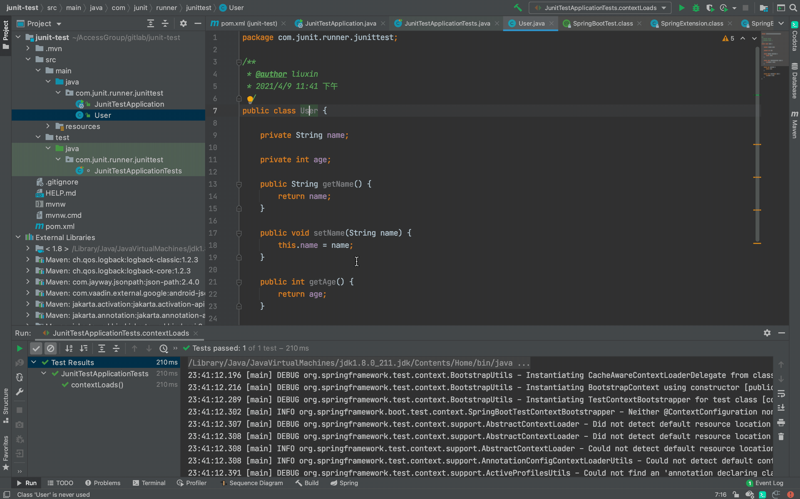

export const Highlight = ({children, color}) => (

{children}

);

:::info 命名规则
单测类: 类名 + `Test` 整体大驼峰

单测方法: `test` + 方法名 整体小驼峰
:::

### 保证目录结构是一致的

在这里有个误区,发现很多同学都是随意去创建测试类,其实这不是一个好的习惯,在Maven项目中,
要尽量保证测试类与被测类的目录结构是一致的。如下图一样。这样的好处是,我们可以快速在
这两个类中进行快捷键跳转,也方便我们去新增测试方法。<Highlight color="green">跳转快捷键和创建快捷键保持一致,见下文.</Highlight>

其实Idea已经为我们提供了快捷操作,如下图。

### 快捷键

