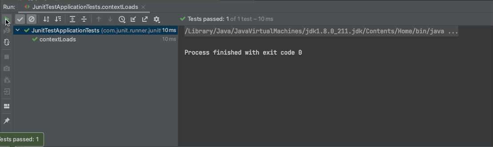

前面我们说了这么多单测。但是执行起来可能还会有不知所措。究竟怎么写单测。
什么样的方法要写单测。什么时候写单测。


## 一、如何写单测

### 1.1 注意命名

- 类以 `*Test` 结尾
- 方法以 `test*` 开头


```java title="类以*Test结尾,方法以test*开头"
public class JunitTest {

    @Test
    public void testJunit(){
        
    }
}
```

### 1.2 禁用Main方法

`Main` 虽然简单,但是却不适合单测,被 `@Test` 修饰的方法运行一起执行。

```java 
    public static void main(String[] args) {
        // 禁用
    }
    
    @Test
    public void testJunit() {
        // 推荐
    }
```
### 1.3 使用断言替换打印

充分使用JUnit,通过颜色来观察验证方法,尽量不通过人肉

[断言学习跳转](https://ddd.springlearn.cn/docs/test/junit-api)




## 二、单测范围

### 2.1 Service层

Service层往往是程序的接口层,接受来自Web或者Message、Job的调用。
这一层入参的数据往往会很多,对系统也有相关的依赖,自行评估方案。
这里提供两个曲线救国的方案:
1. 如果不好测试可以对程序的最小单元进行测试,曲线救国。
2. 对某个方法中,不满足测试场景的接口,进行Mockito,以跳过这段逻辑。

### 2.2 核心的计算逻辑

代码中的工具类,或者是比较核心的计算逻辑进行测试。比如根据外部数据进行组装生成新的数据模型的
方法。

### 2.3 Feign接口

外部提供的 `Feign` 接口, 在没有提供实现之前可以先使用 `Mockito`进行Mock
帮助完成接口的测试。

```java 
public class TradeShopIntegrationImplTest extends BaseApplicationTest {

    @Autowired
    private TradeShopIntegration shopBrandIntegration;

    @MockBean
    private BrandServiceApi brandService;
    
    @MockBean
    private GoodsStockApi goodsStockApi;
    
    @Test
    public void testGetAllBrands() {
        Mockito.doReturn(JsonResult.failure("fail")).when(goodsStockApi).getSkuList(Mockito.any());
        // 底层调用的是goodsStockApi.getSkuList()
        List<GoodsBaseMsgDTO> goodsBaseMsgDTOS = shopBrandIntegration.queryAllSku();
        // 因为前面声明了返回fail。所以这里没有数据返回。
        JsonConsoleUtils.println(goodsBaseMsgDTOS);
        // 这里跟上面的区别就是,如果没有声明返回值,就走原来的方法。
        List<OutBrandDTO> allBrands = shopBrandIntegration.getAllBrands();
        JsonConsoleUtils.println(allBrands);
    }
    
}    

```
[Mockito学习跳转](https://ddd.springlearn.cn/docs/test/spring-boot-testing)

## 三、什么时候写单测

后端开发进度: 开发50% + 测试30% + 联调20%

1. 自己代码开发完成后,就应该进行单测。
2. 自己代码开发完了,其他人没有开发完。可以进行Mockito单测,先确保自己的代码没问题。
3. 对自己负责的功能模块进行单测维护。
